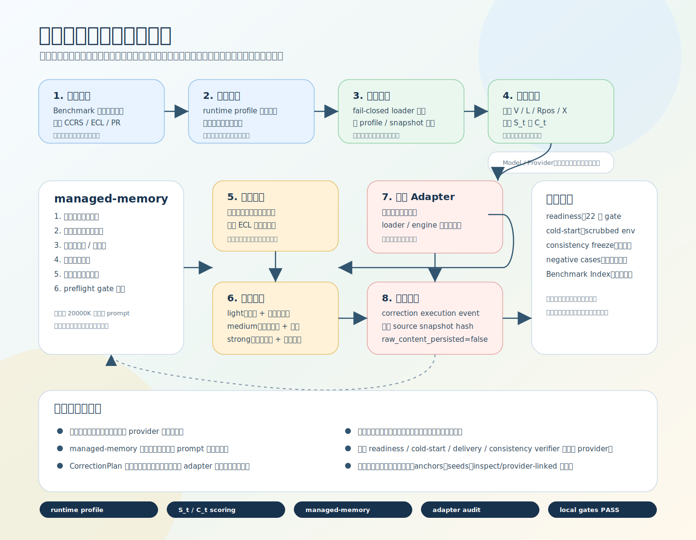
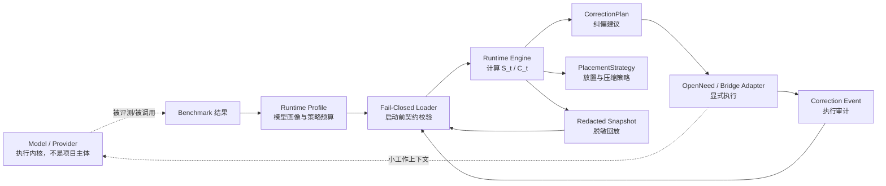
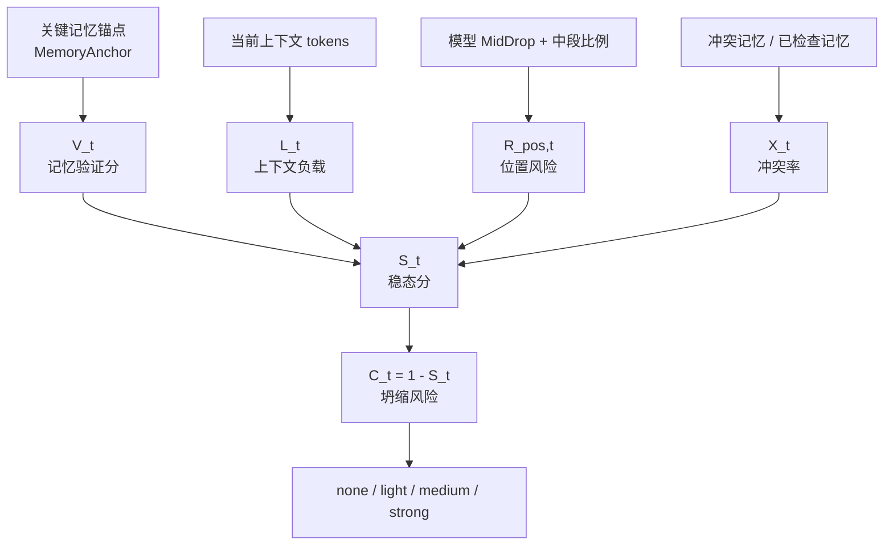

# 记忆稳态引擎技术路径图

更新时间：2026-04-23

属性：本体（图中的 `openneed` / `Product Adapter` 只表示 app 层桥接或兼容执行面，不代表引擎主体归属）

这张图用于解释本线程交付包的技术路径：记忆稳态引擎不是新大模型，而是当前架构里的本体能力。它消费模型 / provider 作为执行内核，被 `agent-passport` 这类 runtime 和 `openneed` 这类 app / bridge 层调用，并把离线 benchmark、在线风险评分、managed-memory、纠偏建议、脱敏快照和桥接审计串成闭环。

注：上面的配图文件名和局部节点命名带历史残留时，以本文文字边界为准；`openneed` 与 adapter 只代表桥接 / 兼容层。

## 一眼看懂

| 区域 | 做什么 | 接地气说法 |
|---|---|---|
| Model / Provider | 只作为被评测和被调用的执行内核。 | 模型是发动机，不是这套系统本身。 |
| 记忆稳态引擎本体 | 负责画像装载、在线风险评分、managed-memory、纠偏建议和脱敏快照。 | 引擎自己负责算、判、稳态维持，不负责产品编排。 |
| 离线画像 | 用 benchmark 生成模型画像、有效上下文、位置风险和证据下限。 | 先给模型做体检，知道它哪里容易忘。 |
| 启动门禁 | 用 fail-closed loader 校验 profile、schema、snapshot。 | 安全检查不过，不让坏策略上车。 |
| 在线监控 | 计算 `V_t / L_t / R_pos,t / X_t / S_t / C_t`。 | 仪表盘持续看记忆稳不稳。 |
| managed-memory | 分块、抽取权威记忆、过滤旧/假/过期候选、压缩成工作上下文。 | 不把一整仓库塞给模型，先整理成靠谱提纲。 |
| 纠偏建议 | 按 `C_t` 生成轻度、中度、强度纠偏建议。 | 只开建议单，不替产品动手。 |
| bridge / adapter 审计 | `openneed` 或其他桥接 adapter 真执行后写 correction execution event。 | 谁在桥接层动手修记忆，要留下收据。 |
| 封板门禁 | readiness、cold-start、consistency freeze 检查边界和证据。 | 上线前让机器按清单复核。 |
| Benchmark Index | 把受控对照、inspect、执行失败和接口上限探测分层。 | 看证据先看目录，避免拿错报告。 |

## 主链路

普通说法：测试结果先变成引擎策略；产品启动前先验策略；运行中看风险；风险升高只生成建议；`openneed` 或其他桥接 adapter 真执行后写审计；快照和审计再反过来支撑复盘和下一轮接入。

## 风险评分链路

普通说法：它不是凭感觉判断“快忘了”，而是把记忆验证、上下文负载、位置风险和冲突率合成一个风险分。

## managed-memory 链路

普通说法：20000K 证据不是裸模型一次吃下 20000K，而是本地先把大材料整理、过滤、压缩，再交给 provider 验证小工作上下文。

## 边界口径

- 这是记忆稳态引擎本体能力，不是新大模型，也不是只挂在产品和模型之间的薄桥接壳。
- 它不训练或修改 DeepSeek、Kimi、豆包、千问、Ollama。
- 它不把 managed-memory 证据说成裸模型单 prompt 窗口能力。
- 本地 readiness、cold-start、delivery、consistency verifier 不触网、不跑大模型、不调用 provider。
- `CorrectionPlan.actions` 是建议，真实纠偏必须由 `openneed` 或其他桥接 / 兼容 adapter 显式执行并写审计事件。
- 图里的 `OpenNeed / Bridge Adapter` 只表示 app 层桥接执行面，不表示引擎主体转移到了 `openneed`。
- 当前目录只提供本线程本地交付包，不表示 OpenNeed 或 Agent Passport 真实源码已经接入。
- Benchmark Index 是证据入口，不能把 execution failure、inspect-only 或接口上限探测误写成模型能力结论。

## 当前证据入口

- `runtime/product-one-page-explainer.md`
- `runtime/final-release-notes.md`
- `runtime/go-live-readiness-report.md`
- `benchmarks/results/INDEX.md`

引用时必须同时带上报告文件、上下文规模、anchors、seeds、是否 managed-memory / inspect / provider-linked，避免把局部样本说成无条件能力结论。
